# Rock Paper Scissors Lizard Spock

## Table of content

1. [Description](#description)
2. [How to play](#how-to-play)
3. [Game rules](#game-rules)
4. [Features](#features)
5. [Technologies used](#technologies-used)
6. [Testing](#testing)
7. [Screenshots](#screenshots)
8. [Deployment](#deployment)
9. [Credits](#credits)
10. [Acknowledgements](#acknowledgements)

#### Description:

The **Rock Paper Scissors Lizard Spock** game is an advanced version of the classic "Rock Paper Scissors" game. It allows you to play agains the computer using five possible choices: Rock, Paper, Scissors, Lizard and Spock. Each round you select an option the computer generate its choice. The game decides the winner based on predefined win rules, display the result on the screen and updates the score.

#### How to play:

1. Select one of the five options available.
2. The computer will randomly select one of the five options available.
3. The game will display the result ('Winner!', 'Loser!' or 'Ohh! It's a Tie!') and update the score.
4. The first to win 3 out of 5 rounds is declared the overall winner. You can restart the game at any time by pressing/click the "Restart Game" button.

#### Game rules:

- Rock beats Scissors and Lizard.
- Paper beats Rock and Spock.
- Scissors beats Paper and Lizard.
- Lizard beats Spock and Paper.
- Spock beats Scissors and Rock.

#### Features:

- **Interactive Gameplay**: The player selects an option and the game provides immediate feedback and updates the score after each round.
- **Score Tracking**: The game displays scores for the player and computer which reset when a new game is started.
- **Best Out Of Five**: The game declares a winner once the player or the computer wins 3 out of 5 rounds, stopping further interactions until the game is restarted.
- **Game Rules Dropdown**: A "Game Rules" button that toggles a dropdown with rules of the game.
- **Restart Button**: Allows the player to restart the game at any time, resetting the scores and messages.
- **Responsive Design**: The game is fully responsive for mobile, tablet and desktop users.
- **Error Handling**: Implements try-catch blocks in some functions to log errors without interupting the game.

#### Technologies used:

- **HTML5** for structure and content.
- **CSS3** for styling the game.
- **JavaScript** for game logic and user interactions.
- **Google Fonts** for typography.
- **Git & GitHub** for version control and deployment.

#### Testing:

##### HTML Validation

The HTML page was tested using [W3C HTML5 Validator](https://validator.w3.org/) and passed with no errors.
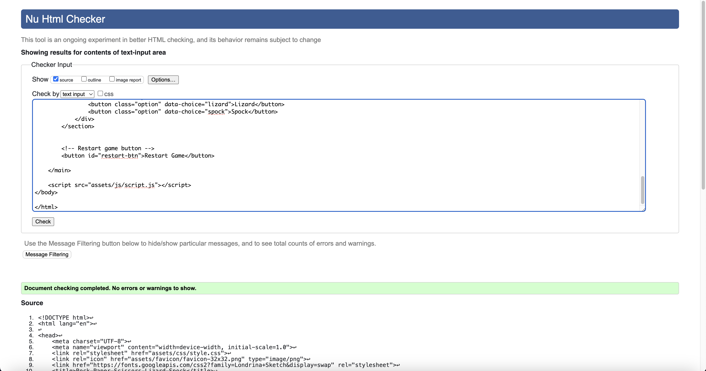

##### CSS Validation

The CSS was tested using [W3C CSS Validator](https://jigsaw.w3.org/css-validator/) and passed with no errors.
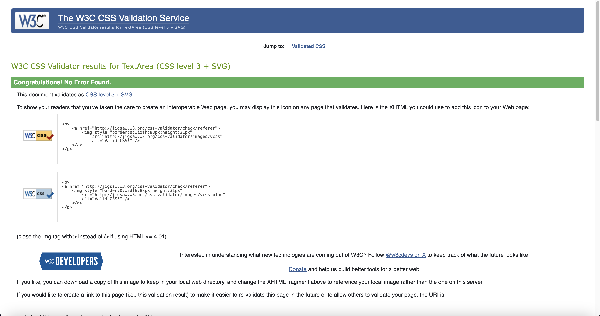

##### JS Validation

The JavaScript was tested using [JSHint](https://jshint.com/). While there are some warnings, these don't affect the functionality of the code.
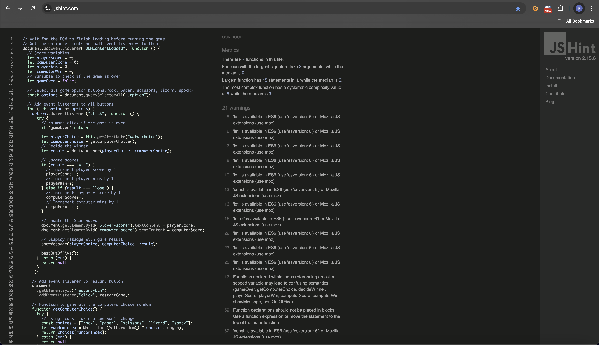
**Note On JSHint Warnings:**
During the JavaScript validation JSHint showed several warnings, including line 17: functions declared within loops referencing outer scoped variables. This occurs in the event listener for "playerChoice" where more outer variables are referenced within a loop("getComputerChoice", "decideWinner", etc). This setup is intentional to handle game logic and interactions and does not impact the functionality of the code or catch unexpected errors, as these outer scoped variables do not change throughout hte game.

##### Accessibility

For accessibily score I used [PageSpeed Insights](https://pagespeed.web.dev/) and it has achieved 100.

  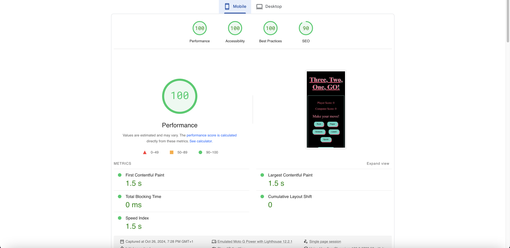
  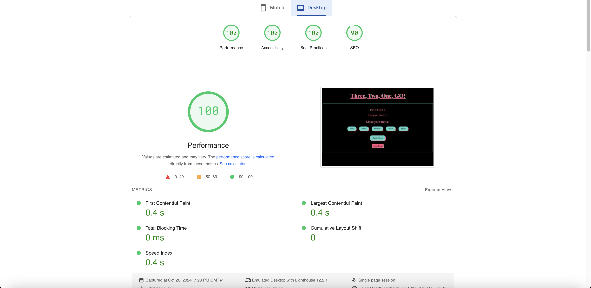

##### Browser Compatibility

The game was tested on multiple browsers to ensure compatibility (Chrome, Safari and Firefox).

##### Responsivness

The game was tested on multiple devices including phone, tablet and desktop.
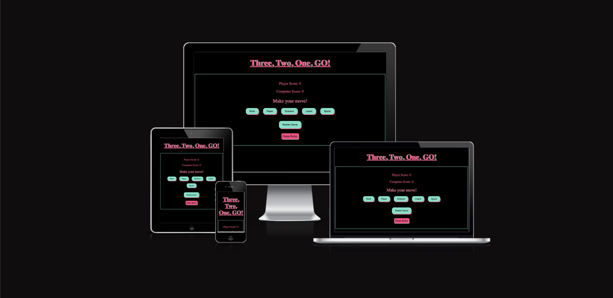

#### Screenshots

**Main Interface** 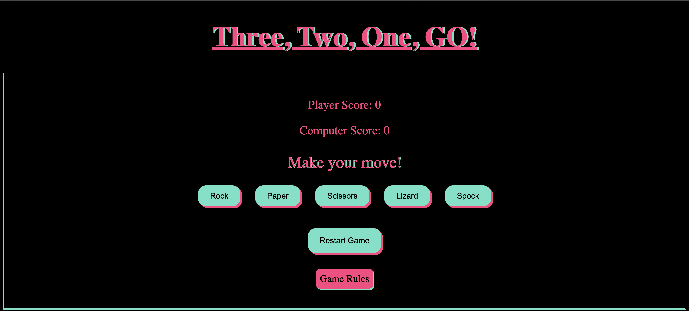
**Restart Button** 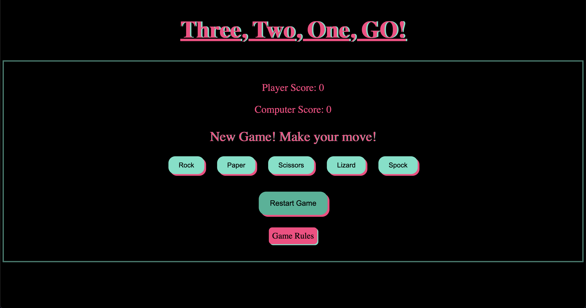
**Game Rules Dropdown** 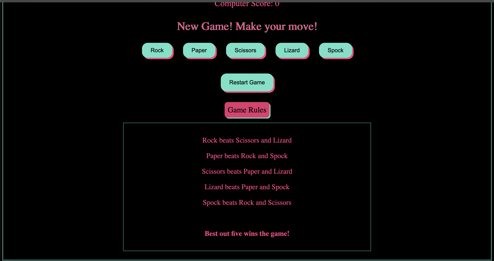
**Gameplay Examples**:
- Player Wins! 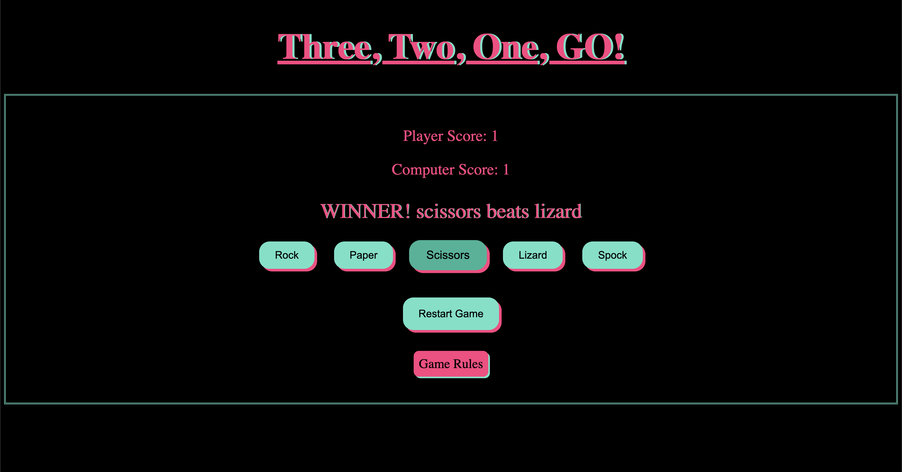
- Computer Wins! 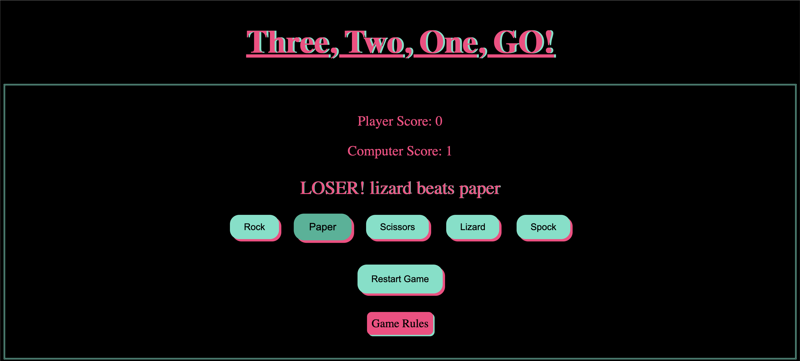
- It's a Tie! 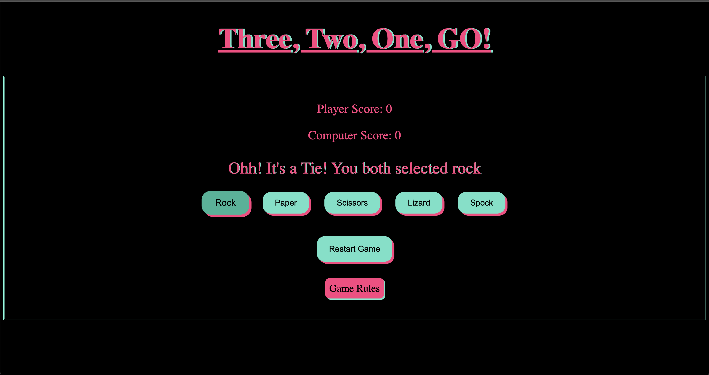
- Best Out Of Five 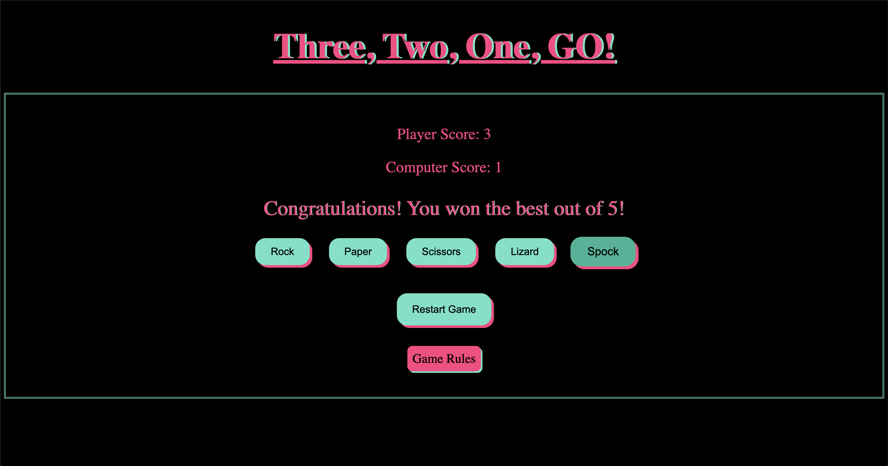

**Console Errors Throughout The Project:**

  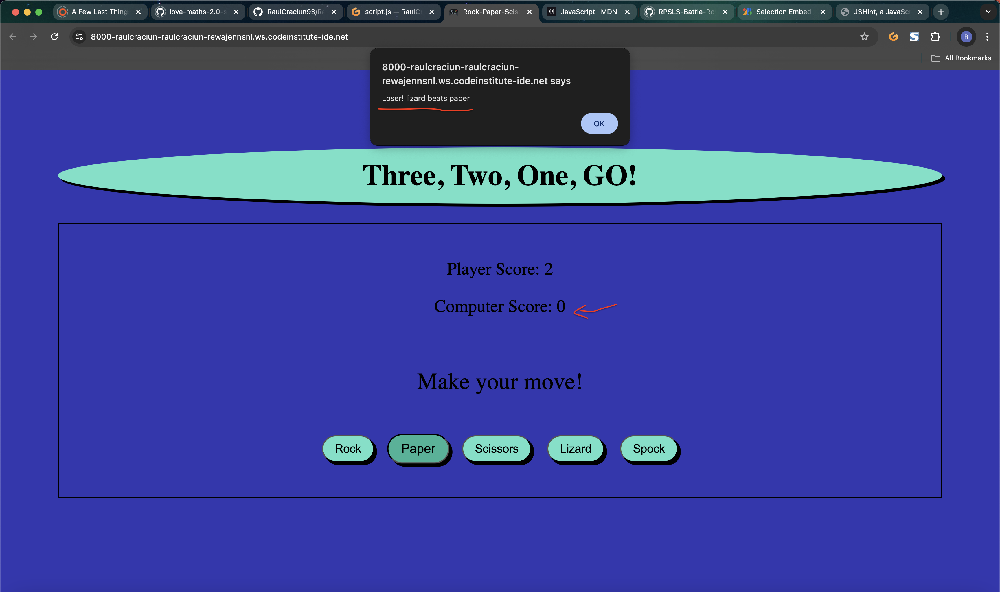
  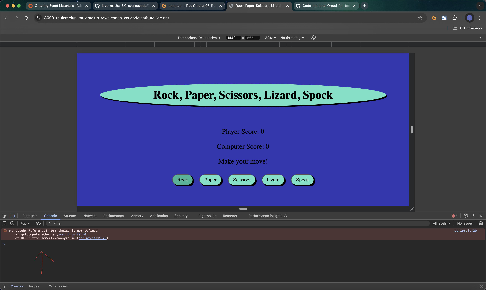

  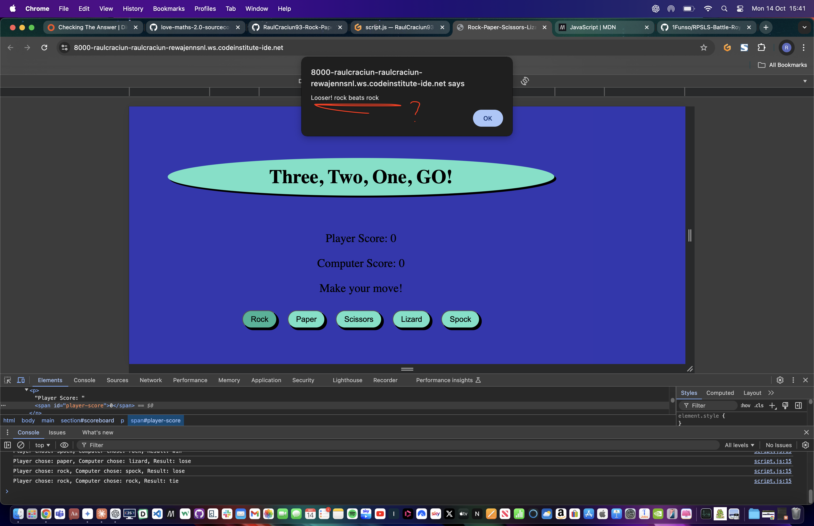
  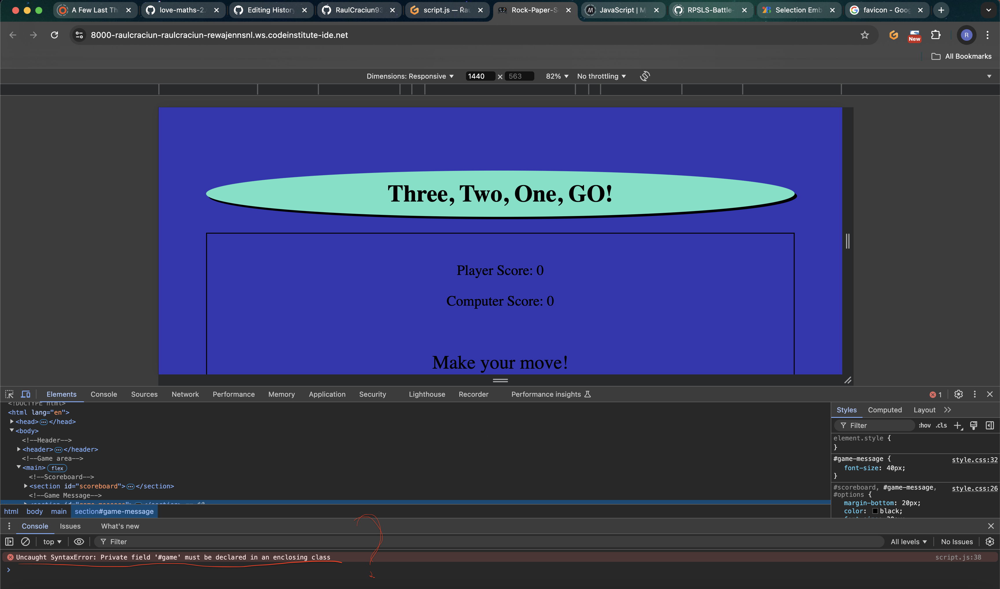

  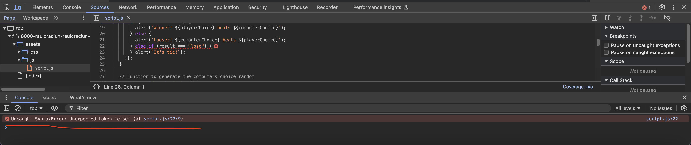
  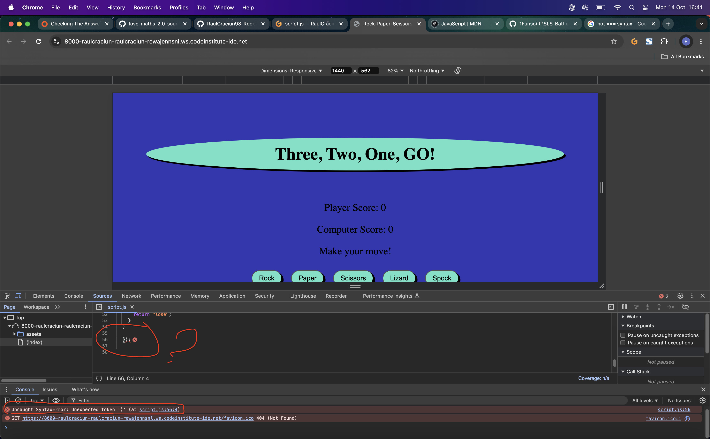

#### Deployment

This project was deployed using GitHub Pages. https://raulcraciun93.github.io/RaulCraciun93-Rock-Paper-Scissors-Lizard-Spock/

To deploy this project:

1. Navigate to your GitHub repository.
2. Go to the "Settings" tab.
3. Scroll down to the "GitHub Pages" section.
4. Under "Source", select the main branch and click "Save".
5. Your project will be published on Github Pages.

#### Credits

- [Code Institute](https://codeinstitute.net/) - Primary learning platform.
- [Udemy](https://www.udemy.com/) - Additional JavaScript online course content.
- [MDN Web Docs](https://developer.mozilla.org/) - Web development documentation and guides.
- [W3Schools](https://www.w3schools.com/) - Quick references and tutorials.
- [CSS-Tricks](https://css-tricks.com/) - CSS solutions and techniques.
- [YouTube](https://www.youtube.com/) - Various tutorials and channels for specific implementation techniques.

#### Acknowledgements

I would like extend my sincere thanks to:

- My Code Institute mentor [Rory Patrick Sheridan](https://github.com/Ri-Dearg) for his guidance and support throughout my projects.
- [Code Institute](https://codeinstitute.net) for providing the educational framework and resources.
- The Code Institute Tutor Support Team for technical assistance.
- The [Code Institute Slack community](https://code-institute-room.slack.com) for extra support and problem-solving assistance.
